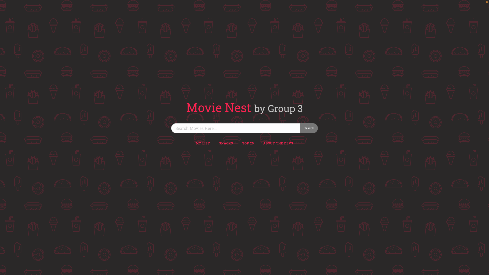

# Movie Search Application

The Movie Search App is a user-friendly web application that allows movie enthusiasts to search for movies, view their details, and save their favorite movies. It provides an easy way to discover new movies and keep track of movie preferences. In addition to these features, the app also offers the following:

- **Top 20 Movies**: View a curated list of the top 20 movies of all time.
- **Bored Feature**: When you're feeling bored and need something fun to do, the Bored Feature can generate random activities to keep you entertained.

## User Story:
* As a movie enthusiast,
* I want to search for movies, view their details, and save my favorite movies
* I can easily discover new movies and keep track of my preferences.

## Acceptance Criteria:
* Given I am a user of the movie search app
* When I open the app
* Then I should be presented with a user-friendly home page to interact with
* Given I am on the main page of the app
* When I search for movies by title or genre
* Then the app should query the external movie database API (e.g., TMDb) and display search results with relevant movie information.
* When I mark a movie as a favorite using a "favorite" button,
* Then the app should store this information locally and visually indicate that the movie is one of my favorites.
* Given I have marked movies as favorites,
* When I navigate away from the app and return,
* Then the app should retrieve and display my favorite movies based on the stored local data.
* Given I am interacting with the app,
* When I want to see my favorite movies,
* Then there should be a dedicated section where I can easily access and view the list of my favorite movies.
* Given I am using the app on different devices,
* When I access it from mobile devices or tablets,
* Then the app's interface should adapt and provide a seamless experience on various screen sizes.

## How to Use

1. Open the Movie Search App in your web browser.

2. Use the search bar on the home page to search for movies by title or genre.

3. Browse the search results and click on a movie card to view its details.

4. To mark a movie as a favorite, click the "Favorite" button on the movie card. The app will store your favorites locally.

5. To view your favorite movies, navigate to the "My List" section of the app. Here, you can see your list of favorite movies.

6. To explore the top 20 movies of all time, go to the "Top 20 Movies" section. You'll find a curated list of the top 20 movies.

7. If you're feeling bored and need an activity, visit the "Bored Feature" page. The app will generate a random activity for you to enjoy.

## Technologies Used

* HTML
* CSS 
* JavaScript
* [Bored API](https://www.boredapi.com/): Random Activity Database
* [TMDb API](https://developer.themoviedb.org/reference/intro/getting-started): Movie Database

## The Application
[Click Here to View the Live Page!](https://lundj227.github.io/group-project-1)

